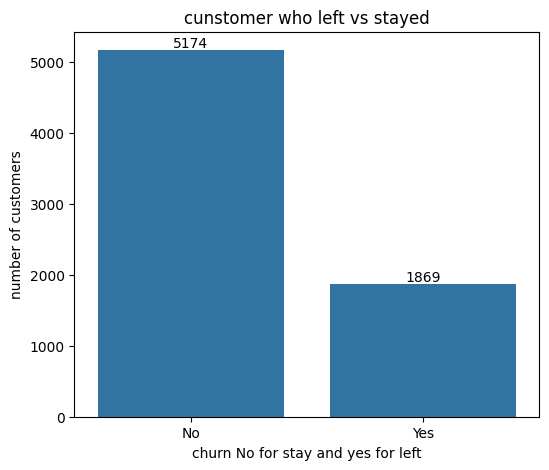
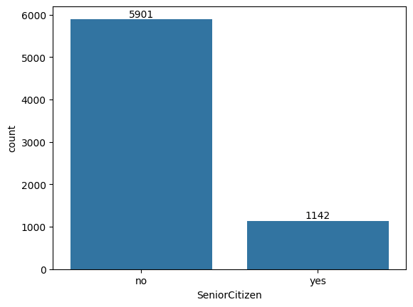
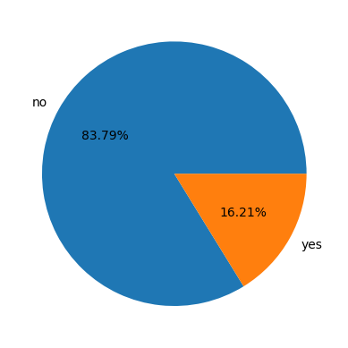
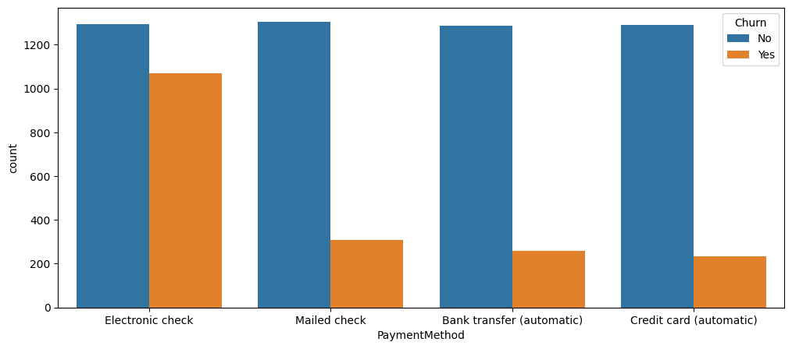

Telco Customer Churn Analysis

📌 Project Overview

This project performs Exploratory Data Analysis (EDA) on the Telco Customer Churn Dataset to understand customer behavior and identify key factors responsible for customer churn.

The objective is to discover actionable insights that help telecom companies reduce customer churn and improve customer retention.

---

📂 Dataset Information

- Total Records: 7,043 customers
- Total Features: 21 columns

Includes:

- Customer demographics (Gender, Senior Citizen, Partner, Dependents)
- Account information (Tenure, Contract, Payment Method)
- Services used (Internet, Phone, Streaming, Security, Support)
- Charges (MonthlyCharges, TotalCharges)
- Target variable: Churn (Yes/No)

---

🛠️ Technologies Used

- Python
- Pandas
- NumPy
- Matplotlib
- Seaborn
- Jupyter Notebook

---

🔧 Data Cleaning Steps

- Converted "TotalCharges" from object to float
- Replaced blank values with 0
- Converted "SeniorCitizen":
  - 0 → No
  - 1 → Yes
- Checked for:
  - Missing values
  - Duplicate records

---

📊 Overall Churn Insight

- Total churn rate: 26.54%
- Majority (≈73%) customers are retained

---

📷 Visual Insights from Analysis

📷 Visual Insights from Analysis

1. Overall Churn Distribution

---

2. Gender vs Churn

---

3. Senior Citizen Analysis

---

4. Tenure vs Churn

---

5. Contract Type vs Churn

---

6. Services Usage Analysis

---

7. Internet Service Impact

Outcome:

- Fiber optic users show higher churn
- DSL users are comparatively more stable

---

8. Payment Method vs Churn

Outcome:

- Customers using Electronic Check have the highest churn
- Automatic payment methods show better retention
---

📌 Final Business Insights

High-Risk Customers:

- Month-to-month contract users
- New customers (low tenure)
- Senior citizens
- Electronic check users
- Customers without support/security services

Recommended Retention Strategies:

- Encourage long-term contracts
- Promote automatic payment options
- Provide onboarding support for new customers
- Offer value-added services (Tech Support, Online Security)

---

📁 Project Structure

Churn-analysis/
│
├── Cumtomer_Churn_Analysis_raw.ipynb
├── Summary of customer churn Analysis.pdf
├── images/
│   ├── download.png
│   ├── download (1).png
│   ├── download (2).png
│   ├── download (3).png
│   ├── download (4).png
│   ├── download (5).png
│   ├── download (6).png
│   ├── download (7).png
│   ├── download (8).png
│   ├── download (9).png
└── README.md

---

🚀 Future Work

- Build a Machine Learning model for churn prediction
- Create an interactive dashboard using Streamlit or Power BI

---

👤 Author

Priyam Khare
MCA | Data Analyst
Python | SQL | Excel | Tableau
