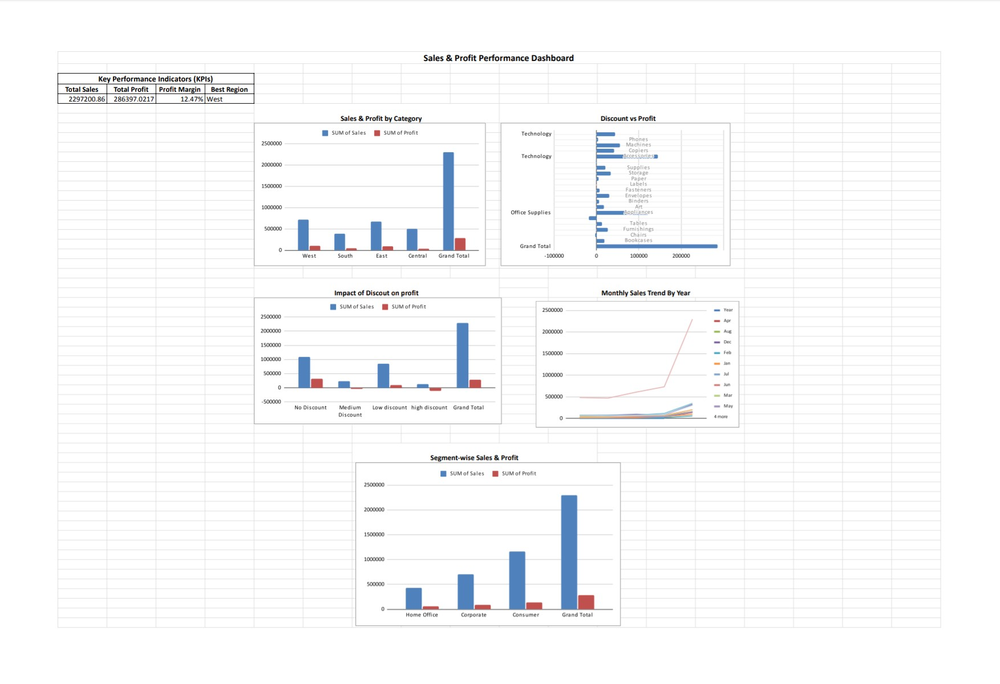

# 📊 Superstore Sales & Profit Dashboard (Google Sheets)

## 📌 Project Overview
This project presents an interactive **Sales & Profit Dashboard** built using **Google Sheets** to analyze the Superstore dataset from **2014 to 2017**.  
The dashboard transforms raw transactional data into clear, visual business insights using pivot tables, KPIs, and charts.

The objective of this project is to demonstrate **data analysis, visualization, and dashboard design skills** suitable for a **Data Analyst / Business Analyst** role.

---

## 📸 Dashboard Preview

---

## 🗂 Dataset
- **Dataset:** Superstore Sales Data  
- **Period Covered:** 2014 – 2017  
- **Key Fields:**
  - Order Date, Ship Date
  - Region, State, City
  - Category, Sub-Category
  - Segment
  - Sales, Quantity, Discount, Profit

---

## 🎯 Objectives
- Analyze overall sales and profit performance
- Identify high and low performing regions and segments
- Evaluate the impact of discounts on profitability
- Understand monthly and yearly sales trends
- Build a clean, recruiter-ready dashboard in Google Sheets

---

## 🧠 Analysis Performed
The following pivot-based analyses were created:

- Region-wise Sales and Profit Analysis  
- Category and Sub-Category Profit Analysis  
- Discount Impact on Sales and Profit  
- Monthly Sales Trend (Year-wise)  
- Segment-wise Sales and Profit Analysis  

Each analysis is maintained in a separate sheet and dynamically linked to the dashboard charts.

---

## 📈 Dashboard Features
- **Key Performance Indicators (KPIs):**
  - Total Sales
  - Total Profit
  - Profit Margin
  - Best Performing Segment
- **Visualizations:**
  - Column charts for comparisons
  - Trend charts for time-series analysis
  - Segment performance comparison
- **Design Approach:**
  - Dashboard displays only charts and KPIs
  - Pivot tables are stored in separate analysis sheets
  - Clean and easy-to-understand layout

---

## 🛠 Tools & Techniques
- Google Sheets
- Pivot Tables
- KPI Calculations
- Data Aggregation
- Data Visualization & Dashboard Design

---

## 📊 Sheet Structure
- Dashboard  
- Region_Analysis  
- Category_Analysis  
- Discount_Analysis  
- Monthly_Analysis  
- Segment_Analysis  

---

## 📌 Key Insights
- Consumer segment contributes the highest sales and profit
- Higher discounts significantly reduce profitability
- Technology category is the most profitable
- Sales show strong growth during year-end months
- Regional performance varies across different U.S. regions

---

## 📤 Output & Sharing
- Dashboard exported as **PDF/PNG** for resume and portfolio use
- Google Sheets shared in **view-only mode**
- Suitable for recruiter review and business presentation

---

## 🚀 Outcome
This project demonstrates the ability to:
- Convert raw data into meaningful insights
- Design professional dashboards in Google Sheets
- Communicate business performance effectively using visuals

---

## 👤 Author
**Priyam Khare**  
MCA Graduate | Aspiring Data Analyst
