🌳 Decision Tree Regression for Price Prediction

📌 Project Overview

This project demonstrates the implementation of Decision Tree Regression to predict a continuous target variable (Price) based on multiple numerical features.

The objective of this project is to:

- 🔍 Understand data distribution and feature behavior
- 📊 Explore relationships between features and target
- 🌳 Build a non-linear predictive model using Decision Trees
- 📈 Evaluate model performance
- 🖼️ Visualize insights for better interpretation

This project represents a complete Data Analysis + Machine Learning workflow.

---

🎯 Problem Statement

The goal is to predict Price using multiple independent variables and capture complex non-linear relationships that cannot be modeled effectively using simple linear methods.

Decision Tree Regression is used because it:

- Handles non-linear patterns
- Works well with feature interactions
- Requires minimal data preprocessing

---

⚙️ Workflow

1️⃣ Data Loading

- Dataset imported using Pandas
- Data structure and data types examined
- Missing values and basic statistics checked

---

2️⃣ Exploratory Data Analysis (EDA)

- Distribution analysis of important variables
- Feature relationships with Price
- Pattern detection and outlier identification

---

📊 Visualizations & Analysis

All images are stored inside the images folder.

---

1️⃣ Target Variable Distribution

images/download.png

Insight:

- Shows overall distribution of Price
- Helps identify skewness and spread
- Useful for understanding prediction difficulty

---

2️⃣ Correlation / Initial Data Overview

images/download_1.png

Insight:

- Provides an overview of feature relationships
- Helps identify important predictors

---

3️⃣ Feature vs Price Analysis (EDA)

The following scatter plots were generated using:

X_col = "price"
for col in df.select_dtypes(include=["int64","float64"]).columns:
    if col != X_col:
        df.plot(kind="scatter", x=X_col, y=col)

These plots help understand how each feature affects Price.

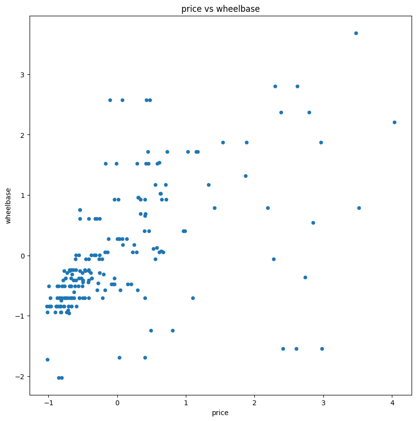
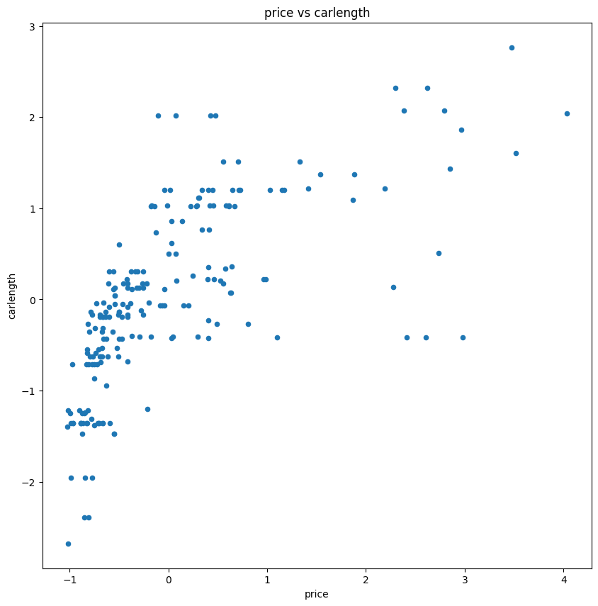

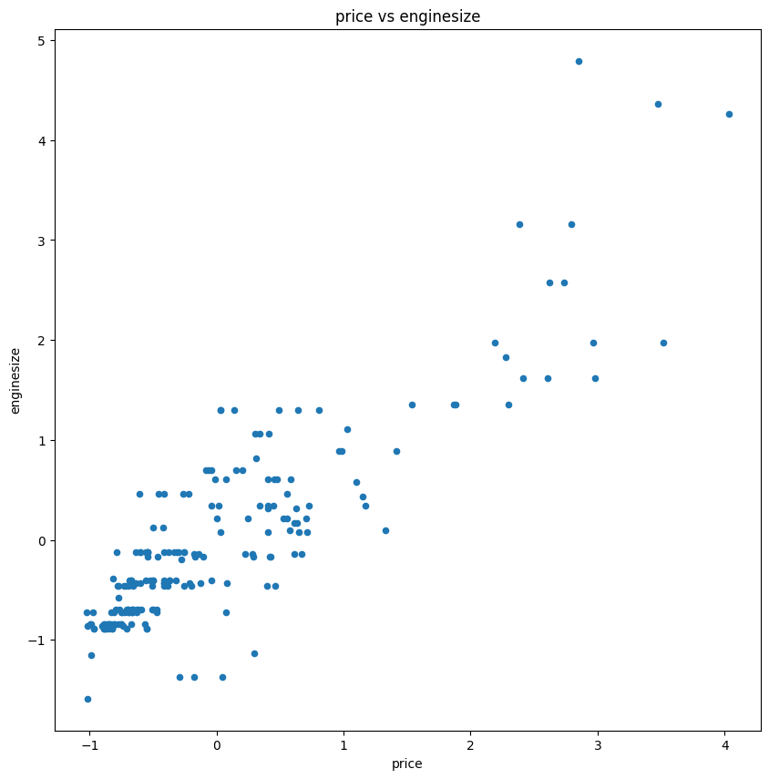
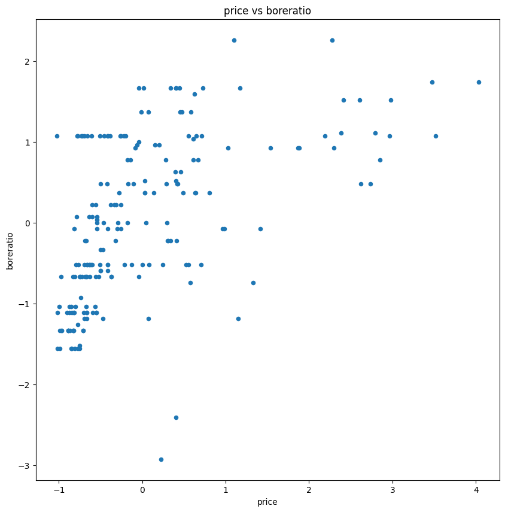
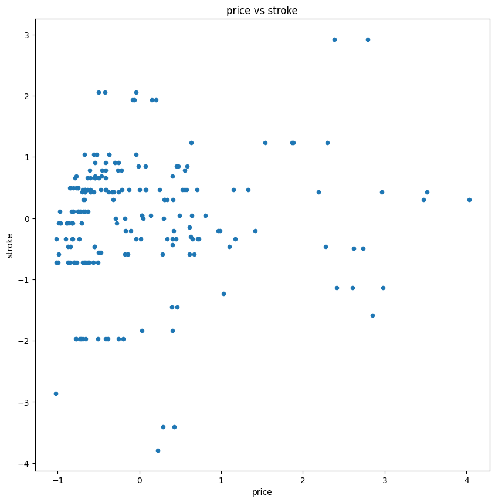

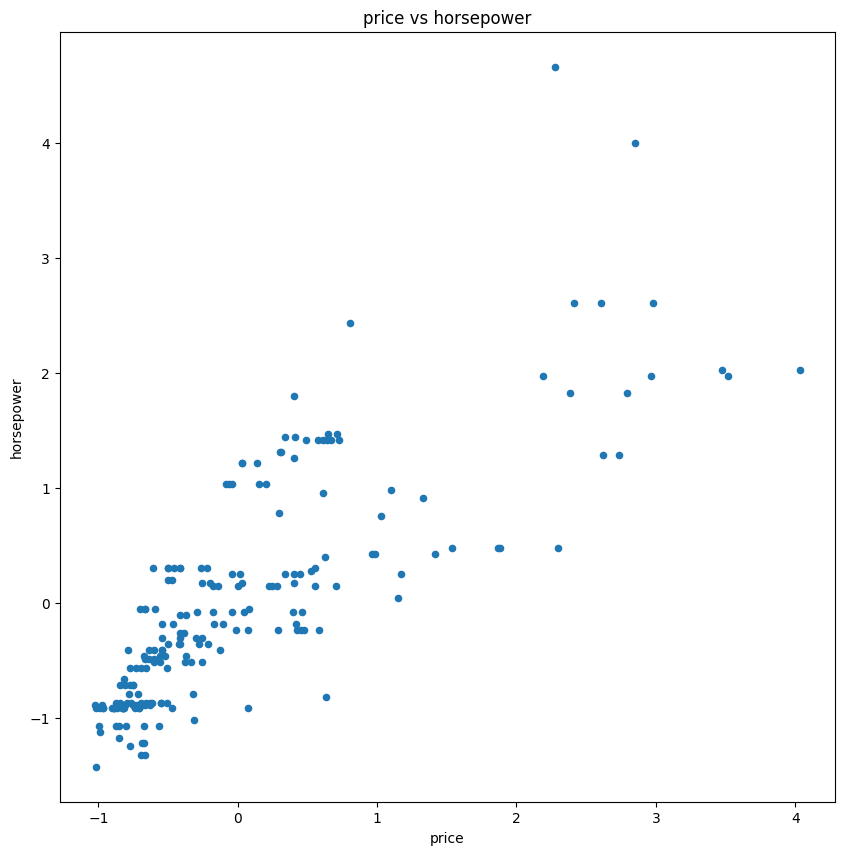
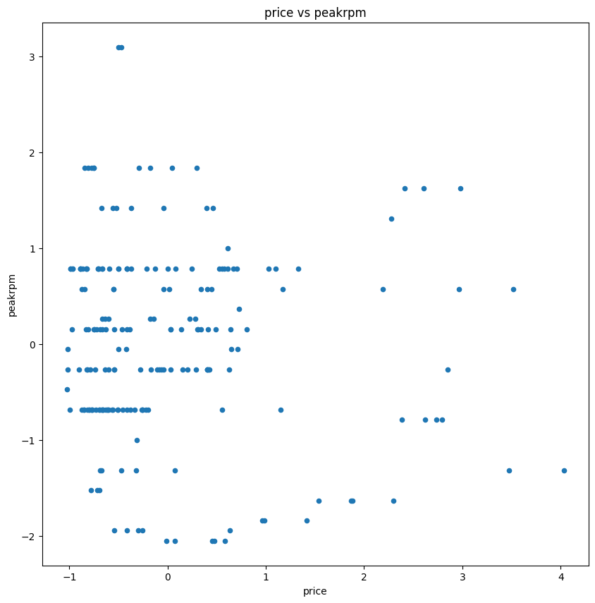
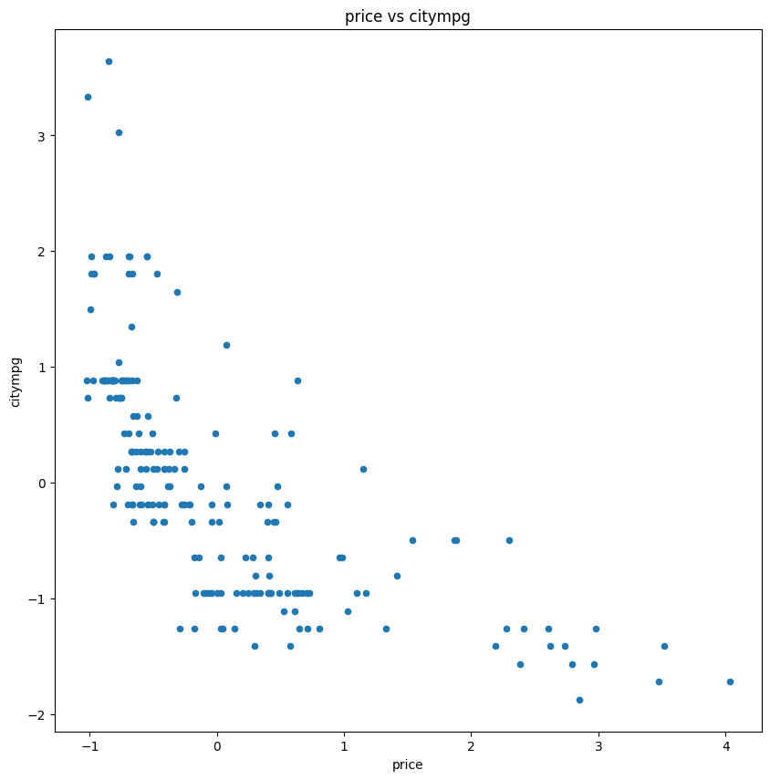
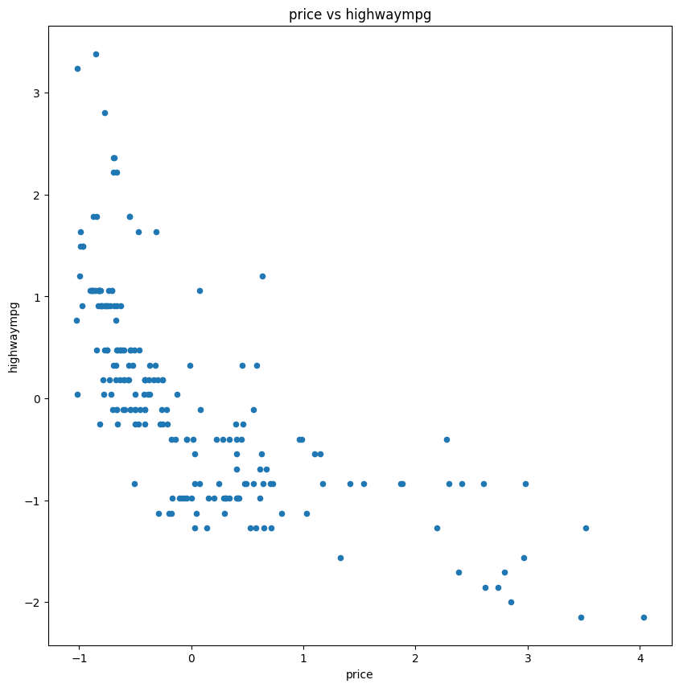

Insights:

- Some features show strong influence on price
- Presence of non-linear patterns
- Outliers visible in certain features
- Confirms the need for a tree-based model

---

🌳 Model Building

4️⃣ Data Preparation

- Feature selection performed
- Data split into Train (80%) and Test (20%)

---

5️⃣ Decision Tree Training

- Model used: "DecisionTreeRegressor" from Scikit-learn
- Tree learns decision rules based on feature values

---

6️⃣ Model Prediction & Evaluation

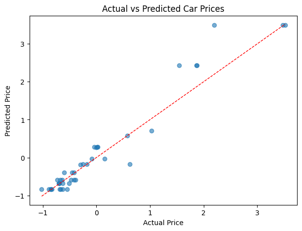
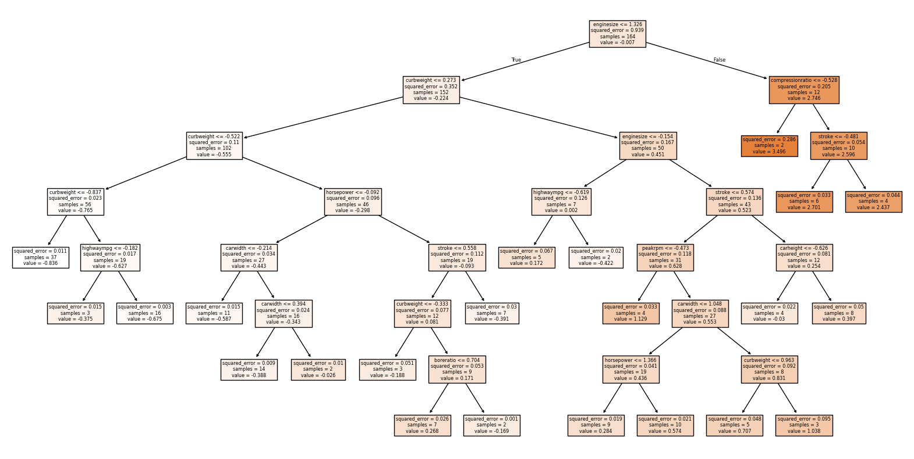
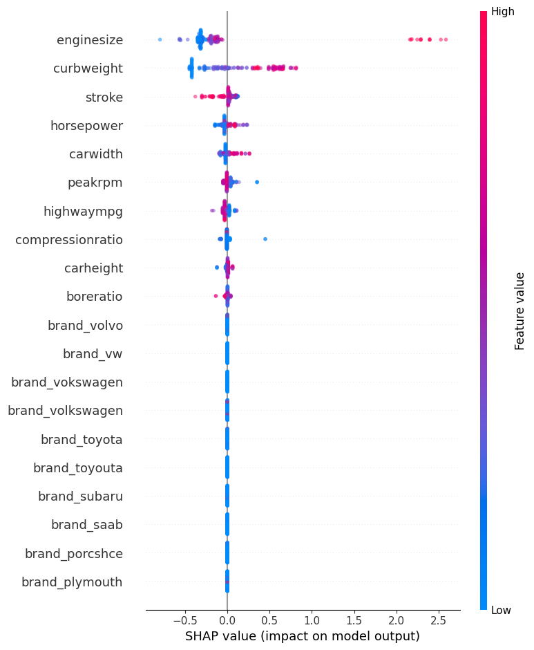

Evaluation Metrics:

- 📉 Mean Squared Error (MSE)
- 📈 R² Score

Insights:

- Model captures complex patterns
- Good performance on unseen data
- Helps visualize prediction accuracy

---

📁 Project Structure

03_Decision_Tree_Regression/
│
├── Decision_Tree_Regression.ipynb
├── dataset.csv
├── images/
│   ├── download.png
│   ├── download_1.png
│   ├── download_2.png
│   ├── download_3.png
│   ├── download_4.png
│   ├── download_5.png
│   ├── download_6.png
│   ├── download_7.png
│   ├── download_8.png
│   ├── download_9.png
│   ├── download_10.png
│   ├── download_11.png
│   ├── download_12.png
│   ├── download_13.png
│   ├── download_14.png
│   ├── download_15.png
│   └── download_16.png
└── README.md

---

🛠️ Technologies Used

- Python 🐍
- Pandas
- NumPy
- Matplotlib
- Scikit-learn

---

🎓 Key Learnings

- Understanding non-linear relationships in data
- Importance of EDA before modeling
- Feature impact analysis using scatter plots
- Decision Tree working mechanism
- Model evaluation using regression metrics

---

✅ Conclusion

The Decision Tree Regression model successfully captured complex relationships between features and Price.

Visual analysis confirmed:

- Presence of non-linear patterns
- Effective model learning
- Good generalization on unseen data

This project demonstrates a complete workflow from Exploratory Data Analysis to Machine Learning model evaluation.

---

👤 Author

Priyam Khare
MCA | Data Analytics & Machine Learning
