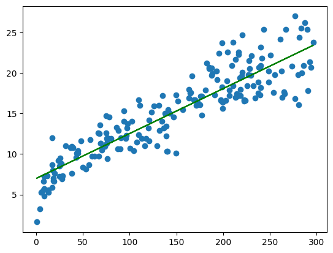

Linear Regression for Predictive Modeling

Project Overview

This project demonstrates the implementation of Linear Regression to analyze the relationship between input features and a continuous target variable.

The objective of this project is to:

- Understand data distribution
- Explore relationships between variables
- Build a predictive model
- Evaluate model performance
- Visualize insights using graphs

This project represents a complete Data Analysis + Machine Learning workflow.

---

Problem Statement

The goal is to predict a continuous outcome based on one or more independent variables using Linear Regression and understand how the target variable changes with respect to input features.

---

Workflow

1. Data Loading

- Dataset imported using Pandas
- Basic structure and data types checked

2. Data Exploration

- Distribution analysis
- Relationship between features and target
- Identification of patterns and trends

3. Data Preparation

- Feature selection
- Train-Test Split (80:20)

4. Model Building

- Linear Regression model from "sklearn"
- Model trained on training data

5. Model Evaluation

- Predictions generated on test data
- Performance evaluated using:
  - R² Score
  - Mean Squared Error (MSE)

---

Visualizations and Insights

All visualizations are stored inside the images folder.

---

1. Feature Distribution

File: 

Shows the distribution of the main feature or target variable.

Insight:

- Helps understand data spread
- Identifies skewness or outliers
- Confirms whether linear modeling is appropriate

---

2. Feature vs Target Relationship

File: 

Scatter plot showing the relationship between input feature and target.

Insight:

- If points follow a straight-line pattern → strong linear relationship
- Confirms suitability of Linear Regression

---

3. Training Data Visualization

File: 

Shows training data used to fit the model.

Insight:

- Helps understand how the model learns patterns
- Visual confirmation of data distribution

---

4. Regression Line on Training Data

File: 

Displays the fitted regression line over training data.

Insight:

- Shows how well the model fits the training dataset
- Indicates underfitting or good fit

---

5. Regression Line on Test Data

File: 

Predictions plotted against test data.

Insight:

- Evaluates model generalization
- Shows performance on unseen data

---

6. Actual vs Predicted Values

File: 

Scatter plot comparing actual values with predicted values.

Insight:

- Points close to diagonal line → good model performance
- Helps identify prediction errors

---

7. Residual Analysis

File: 

Shows the difference between actual and predicted values.

Insight:

- Random distribution of residuals → good model
- Patterned residuals → model limitations

---

Project Structure

01_Linear_Regression/
│
├── Linear_Regression.ipynb
├── dataset.csv
├── images/
│   ├── download.png
│   ├── download_1.png
│   ├── download_2.png
│   ├── download_3.png
│   ├── download_4.png
│   ├── download_5.png
│   └── download_6.png
└── README.md

---

Technologies Used

- Python
- Pandas
- NumPy
- Matplotlib
- Scikit-learn

---

Key Learnings

- Understanding linear relationships in data
- Data visualization for model validation
- Model training and evaluation
- Importance of residual analysis
- Difference between training and testing performance

---

Conclusion

The Linear Regression model successfully captured the relationship between features and the target variable. Visual analysis confirmed that the model generalizes well to unseen data and provides reliable predictions.

---

Author

Priyam Khare
MCA Gold Medalist | Data Analytics & Machine Learning
