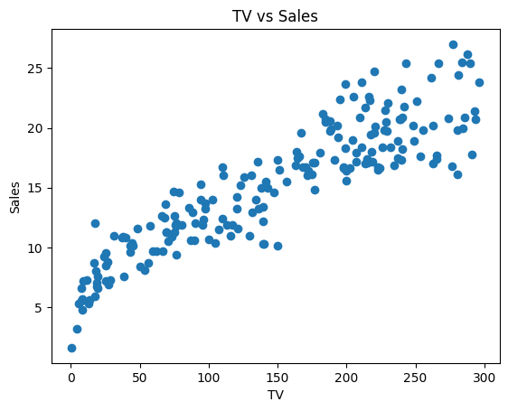
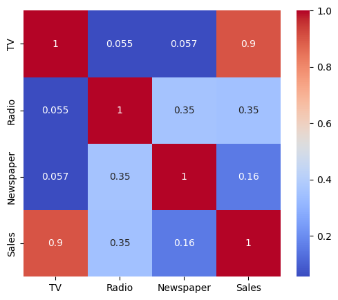
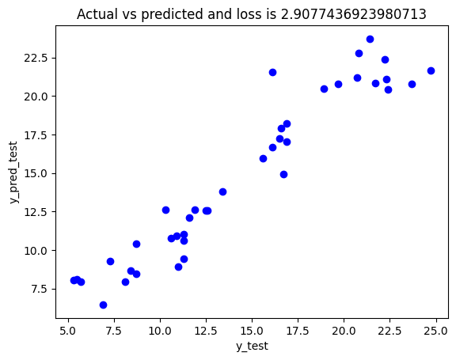

Linear Regression for Predictive Modeling

Project Overview

This project demonstrates an end-to-end implementation of Linear Regression to analyze the relationship between input features and a continuous target variable. The objective is not only to build a predictive model but also to understand the underlying data patterns through detailed analysis and visualization.

The project follows a complete Data Analysis → Model Building → Evaluation pipeline, making it a practical example of a real-world Data Science workflow.

Objectives

- Understand the distribution and characteristics of the data
- Explore relationships between independent variables and the target
- Build a Linear Regression model for prediction
- Evaluate model performance using statistical metrics
- Interpret results using visualizations

---

Problem Statement

The goal of this project is to predict a continuous outcome variable based on one or more independent features using Linear Regression. Additionally, the project aims to analyze how changes in input variables influence the predicted output and to assess whether a linear model is appropriate for the given data.

---

Project Workflow

1. Data Loading and Inspection

- Dataset loaded using Pandas
- Checked dataset shape, structure, and data types
- Verified for missing or inconsistent values

2. Exploratory Data Analysis (EDA)

- Analyzed feature distributions
- Examined relationships between variables
- Identified trends, patterns, and potential outliers

3. Data Preparation

- Selected relevant features
- Defined independent variables (X) and target variable (y)
- Split the dataset into Training (80%) and Testing (20%) sets

4. Model Development

- Implemented Linear Regression using "sklearn"
- Trained the model on the training dataset
- Generated predictions for unseen test data

5. Model Evaluation

Model performance was evaluated using:

- R² Score – Measures how well the model explains variance
- Mean Squared Error (MSE) – Measures prediction error

---

Visualizations and Insights

All visual outputs are stored inside the "images/" folder. Each visualization helps in understanding data behavior and model performance.

---

1. Feature Distribution

Insight:

- Shows how values are spread across the dataset
- Helps detect skewness and outliers
- Confirms whether the data is suitable for linear modeling

---

2. Feature vs Target Relationship

Insight:

- Scatter plot showing correlation between input feature and target
- A linear pattern indicates a strong relationship
- Validates the use of Linear Regression

---

3. Training Data Visualization

Insight:

- Displays the data used to train the model
- Helps understand the pattern the model learns from
- Provides a visual overview of training distribution

---

4. Regression Line on Training Data

Insight:

- Shows the fitted regression line over training data
- Indicates how well the model captures the trend
- Helps identify underfitting or a good fit

---

5. Regression Line on Test Data

Insight:

- Demonstrates model performance on unseen data
- Evaluates generalization capability
- Confirms whether the model performs consistently

---

6. Actual vs Predicted Values

Insight:

- Compares real values with model predictions
- Points closer to the diagonal indicate higher accuracy
- Helps visualize prediction quality

---

7. Residual Analysis

Insight:

- Shows the difference between actual and predicted values
- Random distribution of residuals indicates a well-fitted model
- Patterns in residuals may suggest model limitations

---

Project Structure

01_Linear_Regression/
│
├── Linear_Regression.ipynb
├── dataset.csv
├── images/
│   ├── download.png
│   ├── download_1.png
│   ├── download_2.png
│   ├── download_3.png
│   ├── download_4.png
│   ├── download_5.png
│   └── download_6.png
└── README.md

---

Technologies Used

- Python
- Pandas
- NumPy
- Matplotlib
- Scikit-learn

---

Key Learnings

- Understanding linear relationships in real-world data
- Performing exploratory data analysis for model validation
- Building and evaluating regression models
- Interpreting model performance using visual methods
- Understanding the importance of residual analysis
- Differentiating between training performance and real-world generalization

---

Conclusion

The Linear Regression model successfully captured the relationship between the input feature(s) and the target variable. Visual analysis and evaluation metrics indicate that the model generalizes well to unseen data and provides reliable predictions. This project demonstrates the importance of combining data analysis with machine learning to build interpretable and effective predictive models.

---

Author

Priyam Khare
MCA | Data Analytics | Machine Learning | Python | SQL
